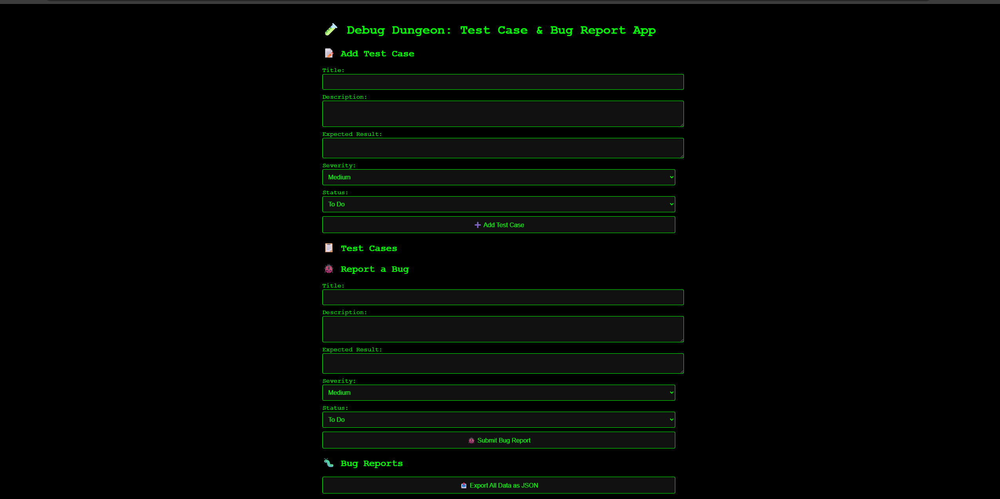

# 🐞 DebugDungeon: QA Test Case & Bug Tracker



**DebugDungeon** is a lightweight, browser-based tool for creating, editing, and exporting test cases and bug reports.  
Built with vanilla JavaScript, HTML, and CSS — no backend, no build tools, no setup.

---

## 🔍 Features

- ✅ Add and manage **Test Cases** with severity, status, and expected results
- 🐛 Log and track **Bug Reports**
- ✏️ Edit and 🗑️ Delete entries instantly
- 📤 Export everything as `qa-data.json`
- ⚡ Fully browser-based, no login or install required

---

## 🚀 Getting Started

1. **Clone the repo**:
   ```bash
   git clone https://github.com/LilyEngineer/DebugDungeon.git
   cd DebugDungeon
